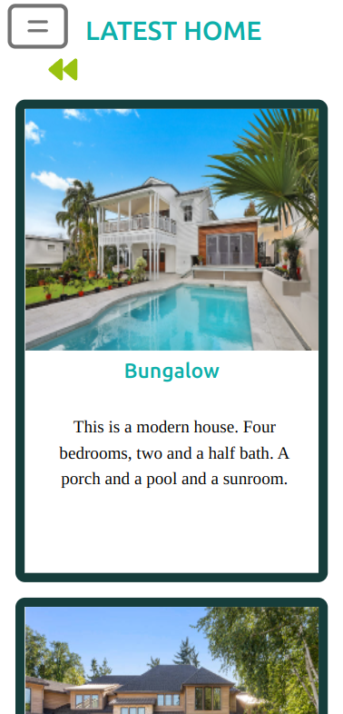
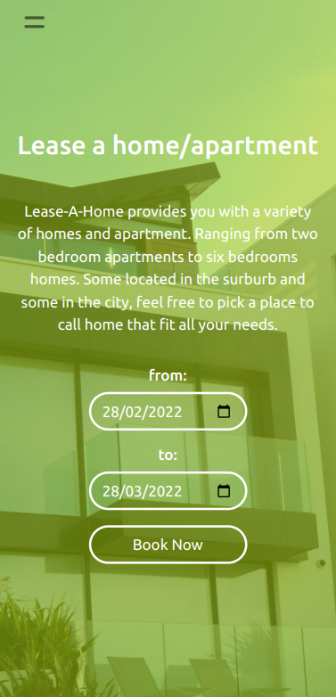
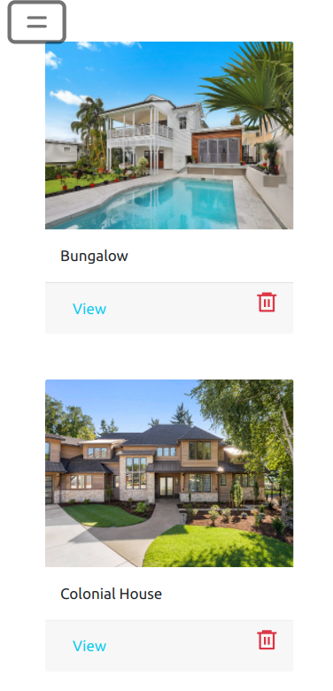

# Lease A Home

>This is an apartment webapp that allows a user to sign up, log in, and make leases on particular apartments. The user, apartments, and leases are stored in this [API](https://lease-a-home-api.herokuapp.com/apartments).
>
>Here is a [link](https://github.com/chaw-bot/lease-a-home-API/tree/main) to the API repo.

## Kanban board
> - [Link](https://github.com/chaw-bot/lease-a-home-API/projects/1) to the Kanban board.
> - [Link](https://user-images.githubusercontent.com/58692590/155709772-22e11087-de10-4eb6-9b09-dcdd13aa49e6.png
) the screenshot of the initial state of your Kanban board.
> - [Link](https://github.com/HENRYKC24/lease-a-home-frontend/tree/main) to the GH repository.
> - [Link](https://lease-a-home.herokuapp.com/) to the live version.
>
>This project consists four members:
>- [Abdul](@wuyepabdul)
>- [Chawanzi](@chaw-bot)
>- [Henry](@HENRYKC24)
>- [Toluwase](@Whoistolu)

## Screenshots
> |Home/Apartments Page|Lease Form| Leases Page |
> |--------------|----------------|----------------|
> ||||

## Built With
>- ReactJS
>- Redux
>- CSS
>- BootStrap

## To get a local copy run the following steps:
>- Copy this link [https://github.com/chaw-bot/lease-a-home-frontend](https://github.com/chaw-bot/lease-a-home-frontend)
>- Open your terminal or command line
>- Run "git clone Paste [https://github.com/chaw-bot/lease-a-home-frontend](https://github.com/chaw-bot/lease-a-home-frontend)"
>- Open the folder with your code editor
>- Create a branch to work on

# Setup

Run :

```
npm install
```

```
npm start
```
# 👤👤 **Authors**

- **Chawanzi Ng'uni**
  - GitHub: [@chaw-bot](https://github.com/chaw-bot)
  - Twitter: [@chawfronaut](https://twitter.com/chawfronaut)
  - LinkedIn: [Chawanzi Ng'uni](https://www.linkedin.com/in/chawanzi-ng-uni-449328212/) 

- **Henry Kc**
  - GitHub: [@githubhandle](https://github.com/HENRYKC24)
  - Twitter: [@twitterhandle](https://twitter.com/henrykc24)
  - LinkedIn: [LinkedIn](https://linkedin.com/in/henry-kc)

- **Ajise Toluwase**
  - GitHub: [@githubhandle](https://github.com/Whoistolu)
  - Twitter: [@twitterhandle](https://twitter.com/Littletolu)
  - LinkedIn: [LinkedIn](https://www.linkedin.com/in/toluwase-ajise-9b40411b2/)

- **Abdul Wuyep**
  - GitHub: [@wuyepabdul](https://github.com/wuyepabdul)
  - Twitter: [@AbdulWuyep](https://twitter.com/AbdulWuyep)
  - LinkedIn: [Abdul Wuyep](https://www.linkedin.com/in/abdul-wuyep/)


# 🤝 Contributing

Contributions, issues, and feature requests are welcome!

Feel free to check the [issues page](https://github.com/chaw-bot/lease-a-home-frontend/issues).

# Acknowledgements
Original design idea by Gregoire Vella on Behance.
[Gregoire Vella on Behance](https://creativecommons.org/licenses/by-nc/4.0/)

## Show your support

Give a ⭐️ if you like this project!
